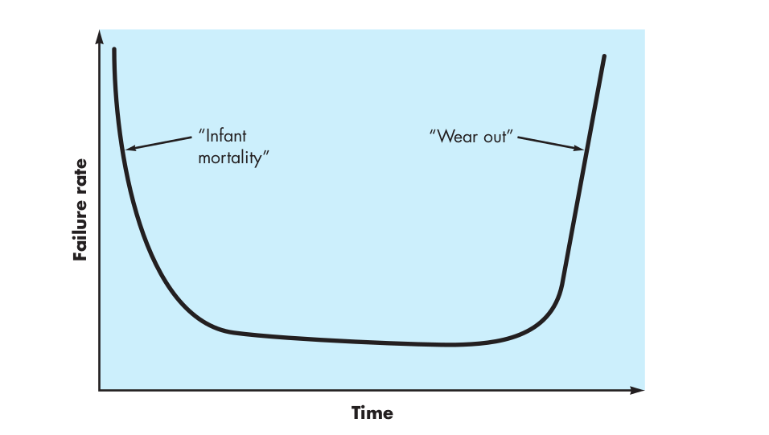
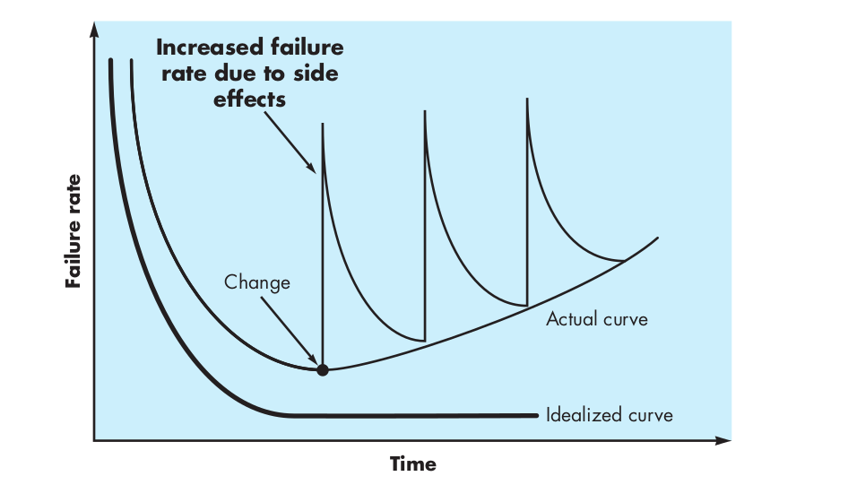

<h3>منابع</h3>
کتاب Software Engineering A Practitioner’s Approach

کتاب Addison.Wesley.Essential.Scrum

<h3>فهرست</h3>

<a href="https://github.com/alireza-fa/software-engineering-tips#%D9%85%D9%87%D9%86%D8%AF%D8%B3%DB%8C-%D9%86%D8%B1%D9%85-%D8%A7%D9%81%D8%B2%D8%A7%D8%B1-%DA%86%DB%8C%D8%B3%D8%AA">1- Software Engineering</a>

<a href="https://github.com/alireza-fa/software-engineering-tips#%D8%B7%D9%88%D9%84-%D8%B9%D9%85%D8%B1">2- Failure rate</a>

<a href="https://github.com/alireza-fa/software-engineering-tips#%D8%AF%D8%A7%D9%85%DB%8C%D9%86-%D9%87%D8%A7%DB%8C-%D9%85%D9%87%D9%86%D8%AF%D8%B3%DB%8C-%D9%86%D8%B1%D9%85-%D8%A7%D9%81%D8%B2%D8%A7%D8%B1">3- Software Engineering Domain</a>

<a href="https://github.com/alireza-fa/software-engineering-tips#%D9%86%D8%B1%D9%85-%D8%A7%D9%81%D8%B2%D8%A7%D8%B1-%D9%85%D9%86%D8%B3%D9%88%D8%AE">4- Legacy Software</a>

<a href="https://github.com/alireza-fa/software-engineering-tips#%D9%81%D9%86%D8%A7%D9%88%D8%B1%DB%8C-%D9%85%D8%AC%D8%A7%D8%B2%DB%8C-%D8%B3%D8%A7%D8%B2%DB%8C">5- Virtualization</a>

<a href="https://github.com/alireza-fa/software-engineering-tips#%D8%B1%D8%A7%DB%8C%D8%A7%D9%86%D8%B4-%D8%A7%D8%A8%D8%B1%DB%8C">6- Cloud Computing</a>

<h3>
مهندسی نرم افزار چیست؟
</h3>
برای اینکه به این سوال پاسخ بدهیم، باید بدانیم که به چه چیزی نرم افزار میگوییم.

نرم افزار:

به چیزی نرم افزار می گوییم که این سه بخش را داشته باشد:

1. کد (code)
2. دیتا (data)
3. مستندات (documentation)

پس یک نرم افزار، شامل این سه مورد هست. حتی اگر کد و دیتا را داشته باشیم. باز هم یک نرم افزار به حساب نمی آید
مگر اینکه مستندات هم داشته باشد.

مستندات دو بخش دارد. بخش اول مستندات برای توسعه دهندگان هست. مانند نحوه کار کردن و توضیح درباره بخش های مختلف نرم افزار
بصورت فنی. بخش دوم مستندات برای استفاده کننده های نهایی و یوزر ها هستش که چگونه از نرم افزار استفاده کنند.

با توجه به توضیحاتی که دادیم، مهندسی نرم افزار یک رویکرد برای توسعه نرم افزار و ساخت، ارائه و نگهداری آن است.

<h3>طول عمر</h3>
طول عمر یک نرم افزار با طول عمر یک سخت افزار تفاوت های بسیاری دارد.

در سخت افزار اول راه و موقع کانفیگ باگ و مشکلاتی وجود دارد اما بعد از این بازه کوتاه بصورت یکنواخت بخوبی کار میکند
تا زمانی که عمر مفیدش به پایان میرسد و مشکلات به سراعش می آیند.

اما نرم افزار در زمان ریلیز باگ های بسیار زیادی رو احتمالا داریم. سپس باگ ها برطرف میشود. اما زمانی که یه فیچر و آپشن جدیدی اضافه میکنیم ممکنه باز هم باگ بوجود بیاید. پس یک نرم افزار طول عمرش شبیه به سخت افزار
نیست و فرازو نشیب های زیادی را دارد.

<h3>دامین های مهندسی نرم افزار</h3>

- System Software:

نوشتن نرم افزار های سیستم مانند Compiler

اشخصاصی با این تخصص نسبتا کم هستند و درآمد های بالایی نیز دارند.

- Application Software

توسعه و ساخت نرم افزار هایی اپلیکیشنی مثل Office

- Engineering/Scientific Software

نرم افزار های مهندسی و عملی مانند matlab که نیاز این دسته از افراد را فراهم می کند.

- Embedded Software

نوشتن نرم افزار برای Embedded ها مانند مایکروفر و ...

یکی از مثال ها اینترنت اشیا هست.

- Product line Software

نرم افزار هایی که تولید می شوند و بر اساس نیاز کاربر شخصی سازی می شوند. مانند Wordpress

- Web/Mobile Software

این دسته را فکر میکنم بخوبی آشنا هستید. مانند برنامه های اندروید و ios و ...

- Artificial Intelligence Software

مانند DeepFake

بجز این دامین ها کلی دامین دیگر هم داریم که به آنها اشاره نمیکنم.

<h3>نرم افزار منسوخ</h3>
نرم افزار منسوخ و یا بهتره بگیم legacy software به نرم افزار هایی گفته میشود که کلی سال از زمان ساخته شدنش میگذرد
و بر روی سیستم عامل ها و یا سخت افزار های قدیمی اجرا میشود. همچنین مشخصا تعویض قطعات سخت افزاری آن سخت است.

<h4>
هزینه نگهداری:
</h4>

از آنجایی که درباره یک نرم افزار منسوخ صحبت میکنیم. هزینه نگهداری آن بالا است.

فرض کنید که سخت افزارش خراب می شود. پیدا کردن سخت افزار مناسبش ممکن است به شدت سخت و گران باشد.

از همه اینها بگذریم، شخصی که بتواند برای این چنین نرم افزاری تغییری بوجود بیاورد و یا با آن کار کند هم به سختی
قابل پیدا کردن است. برای مثال اگر نرم افزار روی سیستم عامل dos احرا شود، در کل ایران چند نفر هستند که می توانند با سیستم dos کار کنند
یا با یک دیتایس قدیمی کار کنند؟

<h4>
emulation:
</h4>

یکی از راه حل ها برای سیستم عامل و سخت افزار این نرم افزار ها، استفاده از یک شبیه ساز است تا برای مثال dos را بر روی
سخت افزار های جدیدمان به راحتی بالا بیاوریم و آن نرم افزار منسوخ به حیات خودش ادامه دهد.

یکی از دلایل اینکه هنوز هم از این نرم افزار ها استفاده می شود این است که هنوز هم بدرد بخور هستند و نیاز را فراهم می کنند.

برای شما که یک مهندس نرم افزار هستید. بهترین کار این است که اصلا کاری به این نرم افزار ها نداشته باشید چون بالاخره خودشان
از رده خارج میشوند.🙂

<h3>فناوری مجازی سازی</h3>
بیایید کمی بریم عقب و برگردیم به دهه 90 که وب و www جا افتاده بود و همه ی کسب و کار ها می خواستند که وب سایت معرفی خودشان را
داشته باشند.

در آغاز وب سایت ها به این صورت کار می کردند که یک سرور داشتیم و روی سرور یک وب سرور مثلا Apache را اجرا میکردیم. کاری که Apache می کرد این بود یک سری فایل های html و css را سرو می کرد
به عبارت وب سایت ها ایستا بودند.

با گذر زمان گفتن چه کاریه که فقط بیایم کسب و کارمون رو معرفی کنیم یا از اونطرف چه کاریه برای هر تغییر روی وب سایت باید
کلی هزینه کنیم.

چیزی که به فکرشون خطور کرد این بود بجای یک وب سایت ایستا، یک اپلیکیشن و منطقی اون پشت وجود داشته باشه و یک حالت داینامیک داشته باشه وب سایت.

در این صورت فقط بجای معرفی کسب و کار اصلا بصورت آنلاین خدماتی را هم عرضه می کنیم.

اینجا بود که یک وب اپلیکیشن مثلا با php می نوشتن و یک دیتابیسیی برای ذخیره اطلاعات مثلا mysql وارد دنیای وب شدند.

خب موضوع این بود که ... باید برای یک وب سایت سه تا سرور تهیه می کردند. یکی برای php یکی برای mysql و یکی هم برای apache.

آیا نمیشد فقط با یک سرور انجامش داد؟

قطعا میشد اما از نظر امنیت اصلا پیشنهاد نمیشد. برای مثال Apache رو میزدن می ترکوندن و به os دسترسی پیدا میکردن، در واقع به کل
بخش های وب سایت دسترسی پیدا میکردن.

پس شرکت ها و کسب و کار های بزرگ همگی سرور های جداگانه برای هر بخش تهیه میکردند.

<h4>
استک lamp:
</h4>

حالا که حرفش شد یه اشاره ریزی به استک لمپ کنیم.

استک لمپ اون موقع ها خیلی پر طرفدار شده بود و همه میرفتن با استفاده از استک لمپ وب سایتشون رو راه مینداختن.

استک LAMP شامل Linux به عنوان سیستم عامل، Apache برای وب سرور، MySql برای دیتابیس و PHP به عنوان زبان برنامه نویسی
استفاده میشد و خیلیم پرکاربرد و پرطرفدار بود. هنوزم هست و وب سایت های زیادی بر روی همین استک سوار هستند.

خب اگه دقت کرده باشید اینکه چند تا سرور تهیه کنیم برای یک وب سایت. اصلا به صرفه و اقتصادی نبود. اینجا بود که فناوری مجازی سازی بوجود آمد.

فناوری مجازی سازی اینگونه عمل میکند که قبل از os چیزی به اسم Hypervisor را نصب می کنیم و بر روی Hypervisor هر چقدر که میخواهیم سیستم عامل نصب میکنیم(البته که با توجه به منابع محدود هستیم).

با فناوری مجازی سازی ایزوله بودن هر قسمت کاملا انجام میشود و اگر مثلا به Apache نفوذ پیدا کنند، نمیتوانند به بقیه بخش ها
دسترسی پیدا کنند. برای اینکار باید Hypervisor را هم بزنن زمین که مشخصا به این راحتی ها شدنی نیست.

با مجازی سازی هزینه ها کمتر شد، امنیت بیشتر شد و کانفیگ کردن و کار کردن با سرور هم راخت تر شد.

مجازی سازی یک سری قابلیت های جذاب دیگری را هم میدهد. برای مثال می توانید از یک ماشین مجازی بک اپ بگیرید و به راحتی دوباره راه اندازی اش کنید.

چند تا از نرم افزار های مجازی سازی معروف و پر استفاده در طول زمان Xen, Kvm, Hyper-v, Virtual Box است.

اما با تمام اینهمه خوبی هایی که اشاره کردیم. باید به این نکته دقت کنید برای راه اندازی هر ماشین مجازی، کرنل آن هم نصب می شود
و یک سیستم عامل کامل بالا می آید که همین باعث سرباز زیادی میشود.

برای حل این مشکل روش container بوجود آمد. معروف ترینش میشود به Docker اشاره کرد.

<h3>رایانش ابری</h3>
طبق عادت، بیاید باز هم برگردیم به عقب 😅

اگر با سیستم عامل و پردازش و این حرف ها آشنایی داشته باشید. با Cluster, Grid, Cloud هم حتما آشنایی دارید. خب بیاید یکم درباره هرکدام توضیح بدم.

<h4>
کلاستر Cluster:
</h4>

در قدیم و همین الان. برای اینکه قدرت پردازشی بالایی داشته باشند سمت سوپر کامپیوتر ها می روند.

در قدیم اکثر مراکز تحقیقاتی بزرگ و دانشگاه های تاپ سوپر کامپیوتر ها را داشتند(البته فکر نکنید خیلی خقن بودن. همون سوپر کامپیوتر ها از قدرت پردازنده گوشی ای که دستتونه هم کمتر بوده).

ولی خب همه مراکز تحقیقاتی و ... بودجه کافی برای تهیه یک سوپر کامپیوتر را نداشتند. پس کاری که میکردند این بود چند تا کامپیوتر را به هم در یک مکان فیزیکی با استفاده از LAN متصل میکردند و
به قدرت پردازش بیشتری می رسیدند.

به این روش کلاستر می گوییم.

<h4>
گرید‌ (Grid):
</h4>

گرید از روی سیستم انتقال حالا بگوییم برق الهام گرفته است.

تفکر پشت گرید این است که می گوید: هر مرکز تحقیقاتی یک یا چند تا سوپر کامپویتر و یا کلاستر دارند که در 24 ساعت شبانه روز
از قدرت پردازش آن استفاده نمی کنند. بجای اینکه بیکار باشند بیاییم کاری کنیم که وقتی مرکز تحقیقاتی ای نیاز به پردازش ندارد دیگران هم بتوانند استفاده کنند.

<h4>
رایانش ابری (Cloud Computing):
</h4>

رایانش ابری را هم میتوان به گونه ای یک کلاستر به حساب آورد با این تفاوت که قدرت Scale خیلی بالاتری دارد.

رایانش ابری بصورت کلی این سه ویژگی خوب ٰVT, ٍElasticity و Utility (Pay as you go) را دارد.

تصور کنید که شما یک وب سایت پر بازدیدی دارید. خب باید یک سرور قدرتمند تهیه کنید. اما مشخصا ترافیک و بازدید وب سایت شما در ساعت 3 بامداد به اندازه ساعت 9 شب نیست.
اما شما بازم مجبورید به اندازه بیشترین مصرف منابع که صورت میکیرد هزینه کنید.

در رایانش ابری شما می توانید مقدار منابع را تغییر دهید و Elasticity بالایی دارید و به راحتی می توانید مقدار CPU و Ram و ... را بسته به
نیاز تغییرش دهید. در نتیجه Utility خوبی دارید و به اندازه که مصرف میکنید هم هزینه میکنید (Pay as you go)

به دو روش می توانید رایانش ابری را تهیه کنید. روش اول استفاده از Public Cloud ها هستند. مانند Amazon Aws, Microsoft Azure, Digital Ocean و در ایران
Arvancloud را داریم.

پابلیک ها مشخصا شما به صورت فیزیکی سرور را در اختیار ندارید و همه چیز در دست سرویس دهنده ابری شما است.

روش دوم Private Cloud ها هستند.

در این روش شما بصورت فیزیکی سرور را در اختیاز دارید و همه ی دیتا هایتات در دست خودتان است. کلاو های شخصی را با Vm vare, Open Stack و میتوان گفت kubernetes راه اندازی کنید.

<h4>
دسته بندی از بعد کاربری کلاود:
</h4>

(درباره این موضوغ قبلا توی کانالم نوشتم. صرفا کپی پیست میکنم)

IaaS (Infrastructure as a Service)
تو IaaS به شما یک چیزی شبیه به سیستم عامل رو میدن و همه کار رو تقریبا خودتون انجام می دید و خب آزادی عملی بیشتری دارید و از اونطرف وظایف و سختی های بیشتری هم دارید.

PaaS (Platform as a Service)
تو این حالت پلتفرم و فریم ورک و یه سری چیز های مورد نیار رو میده تا شما بتونید یه برنامه stalable بنویسید.
مثلا بهتون دیتابیس استیلبل میده. مثل سرویس های azure و aws

SaaS (Software as a Service)
سرویسی مثل جیمیل یک SaaS میشه محسوب کرد.
تو این حالت میان یه software رو میدن که توی کلود داره ران میشه در واقع شما هیچ حسی از کلود ندارید ولی میدونید سرویسه همیشه در دسترس هستش و اگه نیاز بیشتری‌ داشته باشم میتونم نحوه سرویسی که میگیرم رو ارتقا بدیم.

FaaS (Function as a service)
توی faas بهتون این امکانو میده شما یک فانکشن رو بهش بدید.
مثلا یه فانکشنی داریم که یه سری عملیاتی رو انجام میده بهش میگیم اینو دپلوی کن و هروقت نیازش داشتم از این اندپوینت صداش میزنم.
آمازون هم میتونه در حد چند صد هزار در ثانیه این فانکشن رو براتون کال کنه تا برید حالشو ببرید

